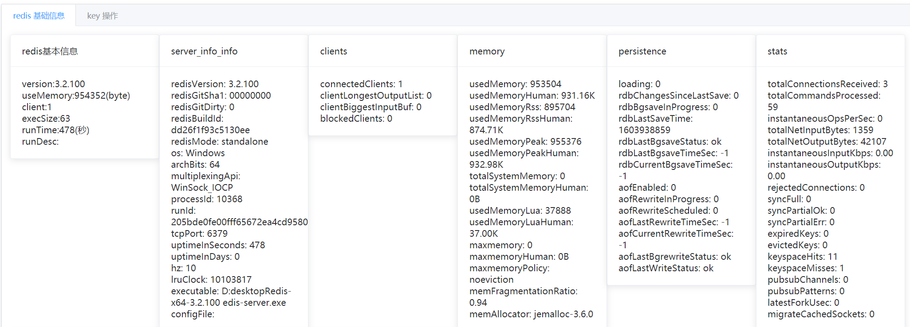
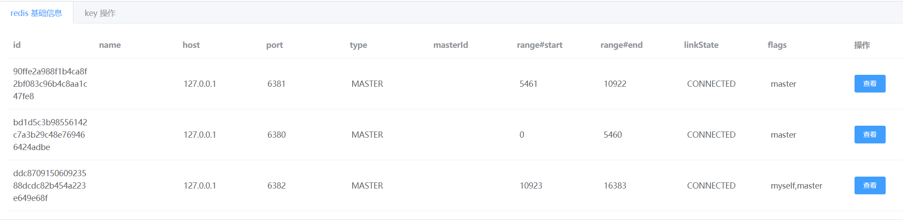
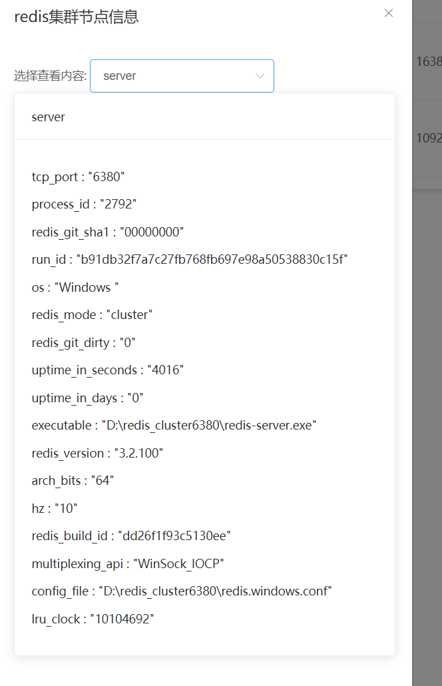

# view redis 接入指南
> author: [huifer](https://github.com/huifer)


- view-redis 支持 redis 和 redis cluster 下面介绍如何接入


- 添加依赖

```xml
<dependency>
    <groupId>com.github.huifer</groupId>
    <artifactId>view-redis-spring-boot-starter</artifactId>
    <version>LAST_VERSION</version>
</dependency>
```
-  配置view-redis账号密码,默认账号密码: redis-admin\redis-admin
   
```yaml
view:
  redis:
    login_name: root
    password: root
```

## redis 单机
1. 配置redis信息
```yaml
spring:
  redis:
    database: 1
    host: 127.0.0.1
    port: 6379
```


## redis cluster 
1. 配置 redis 集群

```yaml
spring:
  redis:
    cluster:
      nodes: localhost:6380,localhost:6381

```


## 浏览
- 配置为成后请访问 `host:port/redis`

### 单机





### 集群




集群节点信息




