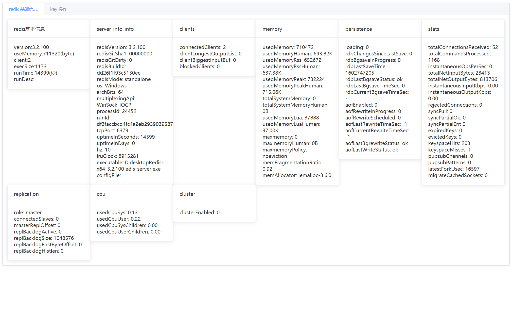
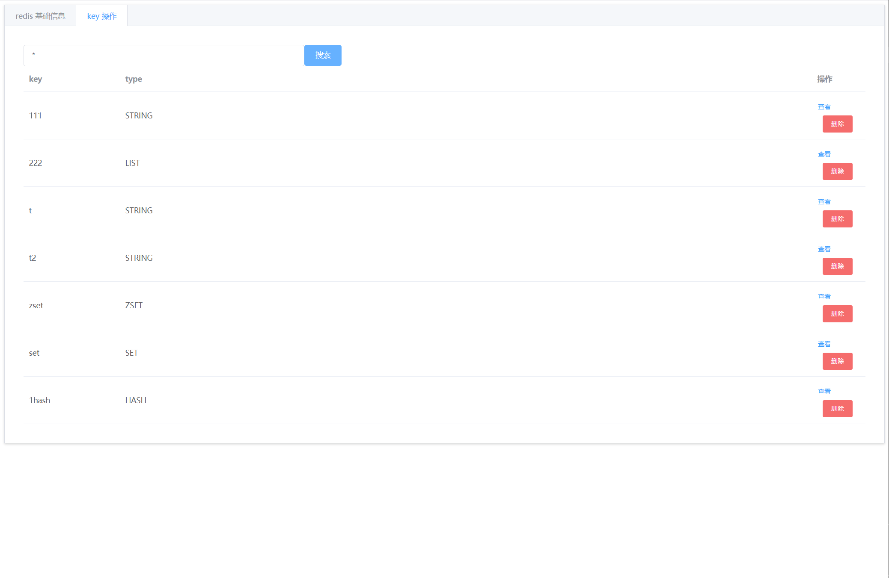
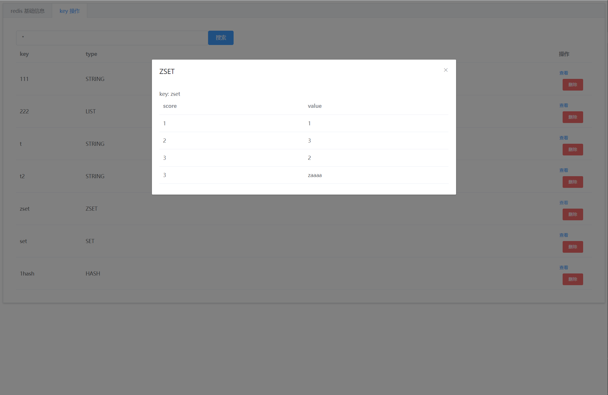

# View Redis 

- 嵌入式 Redis 可视化管理项目.


## Feature
- Redis 服务信息
- Redis key 搜索
- Redis 键值查看

## install 

```shell script
git clone https://github.com/huifer/view-redis.git
cd view-redis
mvn clean install 
```

```xml
		<dependency>
			<groupId>com.github.huifer</groupId>
			<artifactId>view-redis-boot</artifactId>
			<version>last-version</version>
		</dependency>

```

## Using

- 在启动类上增加注解`@EnableViewRedis`
- 如果有拦截器请将`/redis/**/`作为忽略,不执行拦截器逻辑


## 系统截图
- redis 配置相关截图




- redis 键值查询






## Contributers
- [@huifer](https://github.com/huifer)


## License
- Apache License 2.0